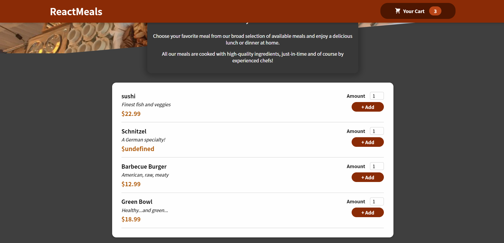

# Meal application

a simple food app developed with react

## Built

---

1. [React.js](https://reactjs.org/)
2. [Redux Toolkit](https://redux-toolkit.js.org/)
3. [ReactStrap](https://reactstrap.github.io/?path=/story/home-installation--page)
4. [CSS](https://developer.mozilla.org/en-US/docs/Web/CSS)
5. [Firebase](https://firebase.google.com/)

## Install

```javascript
// first install all necessary dependencies

npm i

// next run

npm start

```

## Demo


## Screenshot

<!--  -->


## Contributor

Erik Williams
